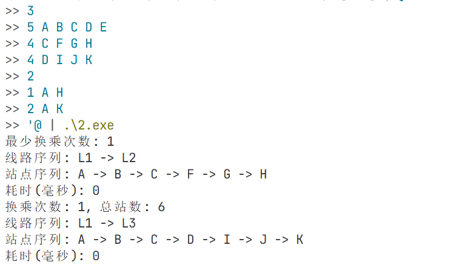

## 题目2：公交线路换乘优化

### 一、算法设计思路
公交网络由“线路-站点序列”组成，同一站点可出现在多条线路中。

本题实现两种优化目标：
1. 最少换乘次数（BFS）
   - 将“线路”作为图节点。
   - 若两条线路共享至少一个站点，则可在该站点换乘，线路之间连边。
   - 从包含起点站的所有线路作为 BFS 起点层，首次到达包含终点站的线路即可得到最少换乘次数。
2. 综合考虑换乘次数与总站数（加权图）
   - 用状态 `(站点, 当前线路)` 建图并 Dijkstra。
   - 沿同一线路相邻站点移动代价为 1（总站数）。
   - 在同一站点换乘到另一条线路代价为 `BIG`（一个很大的常数），从而实现“先最小换乘，再最小总站数”的字典序优化。

### 二、核心代码说明
- 图建模与辅助
  - `lineStations` 存放每条线路的站点序列，`stationLines` 为每个站点所属线路列表，`inLine[l][sid]` 标识站点是否在线路上。
  - `appendSegment(...)` 在某条线路的站点序列中截取 A→B 的站点并拼接到最终站点序列。
- 最少换乘（BFS）
  - `solveMinTransfers(...)` 将“线路”视作图节点；共享站点的线路间可换乘形成边。
  - 从包含起点站的所有线路作为起点层，BFS 首次到达包含终点站的线路即得到最少换乘次数与线路序列，并据此还原站点序列。
- 综合（换乘+总站数，字典序最优）
  - `solveWeighted(...)` 使用状态 `(station, line)` 做 Dijkstra。
  - 在同一线路相邻站移动代价为 1；在同一站换乘到不同线路代价为 `BIG`，实现“先最少换乘、再最少总站数”的字典序优化。
- 代码文件：`main.cpp`、`bus.h`、`bus.cpp`

### 三、复杂度分析
设线路数 `L`，站点数 `S`，所有线路站点总数为 `T`。
- 最少换乘（BFS）：
  - 最坏情况下遍历“线路-站点-线路”的可达关系，时间复杂度约 `O(L*S + T)`，空间 `O(L+T)`。
- 加权方案（Dijkstra）：
  - 状态数约为 `T + 1`，每个状态扩展“相邻站移动 + 站内换乘”，时间复杂度约 `O((T + E) log T)`，空间 `O(T)`。

### 四、运行结果展示
程序会在每次查询后输出“耗时(毫秒)”（基于 `clock()`），可直接截图作为“实测数据”。
示例运行截图：

示例输入：
```
3
5 A B C D E
4 C F G H
4 D I J K
2
1 A H
2 A K
```


### 五、总结与心得
- 仅优化换乘次数时，将“线路”抽象为节点可显著降低问题规模。
- 想同时优化“换乘+总站数”时，需要引入“当前线路”作为状态，才能正确表达换乘代价。
