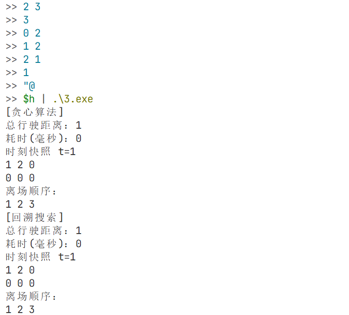

## 题目3：智能停车场空位分配与引导

### 一、算法设计思路
停车场为 `M×N` 的网格车位，入口设在 `(0,0)`，车辆到某车位的移动距离用曼哈顿距离 `r+c` 近似。

实现两种分配策略并比较：
1. 贪心算法（就近停车）
   - 每辆车到达（若车位满则等待到最早离开时刻）后，从当前空位中选择距离入口最近的车位（平局按行列最小）。
2. 回溯算法（最优分配，最小总移动距离）
   - 按车辆进场序列递归选择车位，遇到满位则同样等待到最早离开时刻（该等待不产生分支）。
   - 使用分支限界：若当前累计距离 + 一个乐观下界 ≥ 已知最优，则剪枝。
   - 为避免指数爆炸，程序默认仅在 `K<=12` 时运行回溯求最优。

### 二、核心代码说明
- `runGreedy(...)`：执行贪心调度，输出总距离、耗时、某时刻停车快照、离开顺序。
- `runBacktracking(...)` / `dfsBacktrack(...)`：回溯+剪枝求最优总距离，并输出同样信息。
- `printSnapshot(...)`：根据每辆车的停车区间 `[parkTime, endTime)` 在指定时刻输出车位占用表。

补充说明（实现细节）：
- 贪心流程：按到达序处理每辆车；若满位则推进到最近离场时刻并释放车辆；随后在所有空位中选择 `r+c` 最小的车位，平局按行优先、列优先。
- 释放逻辑：维护活跃车辆的结束时刻；每次释放时按最早结束时间弹出，并列时编号小者优先，同时记录离场顺序。
- 回溯剪枝：为剩余车辆预先计算全局最小的若干车位距离之和作为下界；当“当前累计距离 + 下界 ≥ 已知最优”时剪枝；满位时仅推进时间到最近离场，无需分支。
- 快照输出：在指定时刻 `t`，若某车的 `[parkTime, endTime)` 覆盖 `t`，则在其车位显示该车编号，否则显示 `0`。
- 控制台输出：在 Windows 环境下设置控制台为 UTF-8，确保中文提示正常显示。

核心代码入口：[main.cpp](main.cpp)

### 三、复杂度分析
- 贪心：
  - 每次选空位扫描 `M*N`，对 `K` 辆车，时间复杂度约 `O(K*M*N)`，空间 `O(M*N + K)`。
- 回溯：
  - 最坏指数级（车位选择的组合爆炸），剪枝可显著减少实际搜索量；当 `K` 较大时需限制规模。

### 四、运行结果展示（含实测数据）
程序使用 `clock()` 输出两种算法的运行耗时（毫秒），可直接作为“实测数据”截图来源。

示例输入：
```
3 4
6
0 10
1 9
2 8
3 7
4 6
5 5
4
```
建议截图：
- 贪心与回溯的 `Total distance` 与 `Elapsed(ms)`
- 指定 `snapshotTime` 的占用表
- `Departure order`

示例运行截图：



### 五、总结与心得
- 贪心策略实现简单、速度快，但不保证全局最优。
- 回溯能得到最优解，但复杂度高，需要剪枝与规模限制才能在实际数据上运行。
